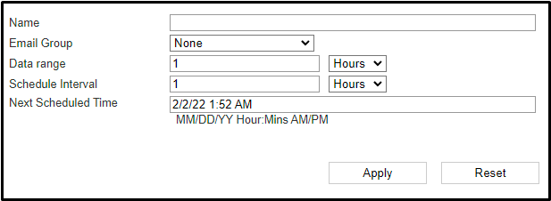

## <span style="color:red">**Проблема**</span>
При попытке перейти в раздел "Schedule" в Web-интерфейса устройства FortiNAC возникает ошибка "Failure:Failed to retrieve Activities:" 

<p align="center">
  
</p>

Такая ошибка может возникнуть при создания задачи по расписанию с нулевым значением поля "Name". Например, при создании задачи для генерации отчета по расписанию:

<p align="center">
  
</p>

## <span style="color:green">**Решение**</span>
Необходимо подключиться к консоли CLI устройства FortiNAC по протоколу SSH (например, с использованием программы Putty)
Выполнить вход в CLI с использованием учетной записи пользователя "root"
Для редактирования списка задач выполняемых по расписанию необходимо использовать команду "schedule"

<span style="color:yellow"> *Команда Schedule*</span>
```bash 
schedule
This program will display and manipulate scheduled tasks.
 
OPTIONS:
        -id     Task ID used with -run, -pause, -enable, -delete and -detail
        -run    To run a task.
        -pause  To pause a task.
        -enable To enable a task.
        -delete To delete a task.
        -detail To display detailed information about a task.
        -all    Dump task information.
        -hidden Show system tasks normally hidden.
 
Example 1 - To dump tasks:
        Schedule -all
 
Example 2 - To run a task:
        Schedule -run -id 2
 
Example 3 - To pause a task:
        Schedule -pause -id 2
 
Example 4 - To Display detail information:
        Schedule -detail -id 2
 
Example 5 - To show all tasks, including hidden:
        Schedule -all -hidden
```
Выполнить команду "schedule -all" для вывода списка задач выполняемых по расписанию
В результате выполнения команды в CLI будет выведен список задач
Необходимо найти задачу с значением "N/A"одного из полей

<span style="color:yellow"> *Исходных список задач*</span>

```bash
schedule -all
ID      name                                    previousScheduledTime           scheduledTime                   pause  hidden
__      ________________________________        ____________________________    ____________________________    _____  ______
1       System Backup                           Mon Jan 31 01:10:15 GMT 2022    Mon Feb 07 01:10:38 GMT 2022    false  false
2       Database Archive and Purge              Mon Jan 31 01:01:15 GMT 2022    Mon Feb 07 01:01:38 GMT 2022    false  false
3       Certificate Expiration Monitor          Tue Sep 27 08:00:00 IST 2022    Wed Sep 28 08:00:00 IST 2022    false  false
4       Database BackUp                         Wed Feb 02 00:01:26 GMT 2022    Thu Feb 03 00:01:38 GMT 2022    false  false
5       Auto-Definition Synchronizer            Sat Sep 24 23:01:00 IST 2022    Sat Oct 01 23:01:00 IST 2022    false  false
6       Synchronize Users with Directory        Tue Feb 01 20:39:12 GMT 2022    Wed Feb 02 02:39:12 GMT 2022    false  false
7       Operating System Update Status          Sun Sep 25 11:01:00 IST 2022    Sun Oct 02 11:01:00 IST 2022    false  false
8       Template Registration Report            Sun Jun 19 23:29:00 IST 2022    Tue Dec 13 17:29:00 GMT 2022    false  false
9       4                                       Sun Jun 19 23:16:00 IST 2022    Tue Dec 13 17:16:00 GMT 2022    false  false
10      default                                 Sun Jun 19 23:16:00 IST 2022    Tue Dec 13 17:16:00 GMT 2022    false  false
11      test                                    Sun Jun 19 23:28:00 IST 2022    Tue Dec 13 17:28:00 GMT 2022    false  false
12      Guest Report                                                            Fri Dec 30 07:30:58 GMT 2022    false  false
13      N/A                                                                     Wed Feb 02 02:55:00 GMT 2022    false  false
```
Далее необходимо удалить данную задачу выполнив команду "schedule -delete -id <id>", где <id> - номер задачи в колонке "ID
После выполнения данной команды список не должен иметь записей со значением "N/A" в одном из полей (при необходимости повторить данную процедуру для другой записи)

<span style="color:yellow"> *Отредактированный список задач* </span>
```bash
schedule -all
ID      name                                    previousScheduledTime           scheduledTime                   pause   hidden
__      ________________________________        ____________________________    ____________________________    _____   ______
1       System Backup                           Mon Jan 31 01:10:15 GMT 2022    Mon Feb 07 01:10:52 GMT 2022    false   false
2       Database Archive and Purge              Mon Jan 31 01:01:15 GMT 2022    Mon Feb 07 01:01:52 GMT 2022    false   false
3       Certificate Expiration Monitor          Tue Sep 27 08:00:00 IST 2022    Wed Sep 28 08:00:00 IST 2022    false   false
4       Database BackUp                         Wed Feb 02 00:01:26 GMT 2022    Thu Feb 03 00:01:52 GMT 2022    false   false
5       Auto-Definition Synchronizer            Sat Sep 24 23:01:00 IST 2022    Sat Oct 01 23:01:00 IST 2022    false   false
6       Synchronize Users with Directory        Tue Feb 01 20:39:12 GMT 2022    Wed Feb 02 02:39:12 GMT 2022    false   false
7       Operating System Update Status          Sun Sep 25 11:01:00 IST 2022    Sun Oct 02 11:01:00 IST 2022    false   false
8       Template Registration Report            Sun Jun 19 23:29:00 IST 2022    Tue Dec 13 17:29:00 GMT 2022    false   false
9       4                                       Sun Jun 19 23:16:00 IST 2022    Tue Dec 13 17:16:00 GMT 2022    false   false
10      default                                 Sun Jun 19 23:16:00 IST 2022    Tue Dec 13 17:16:00 GMT 2022    false   false
11      test                                    Sun Jun 19 23:28:00 IST 2022    Tue Dec 13 17:28:00 GMT 2022    false   false
12      Guest Report                                                            Fri Dec 30 07:30:58 GMT 2022    false   false
```
После выполнения данных действий интерфейс раздела "Schedule" устройства FortiNAC вновь будет доступен